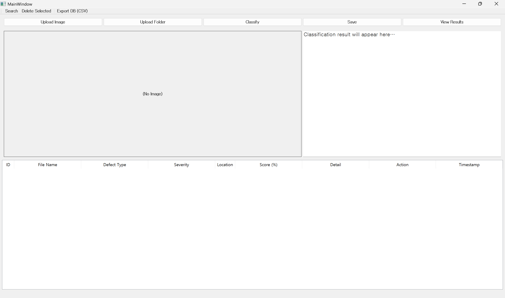
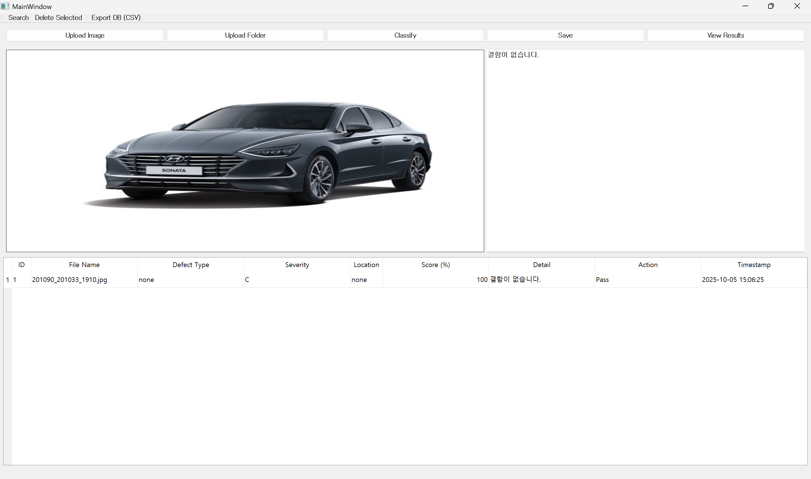
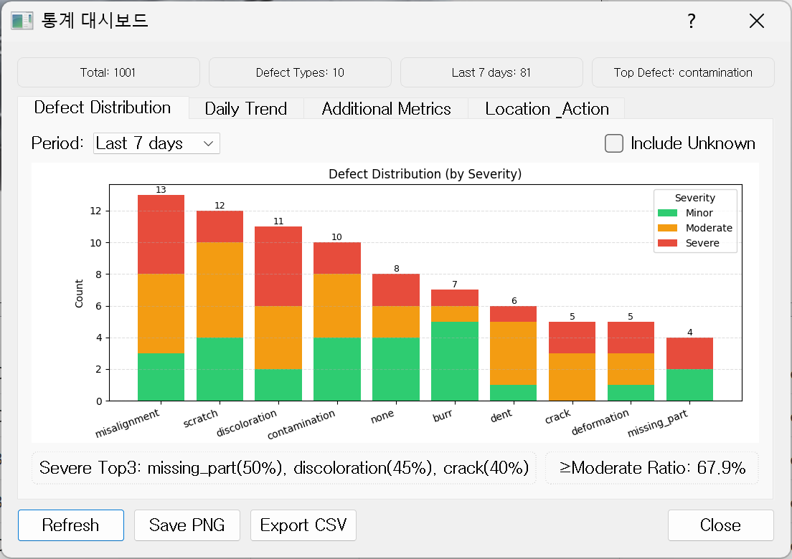
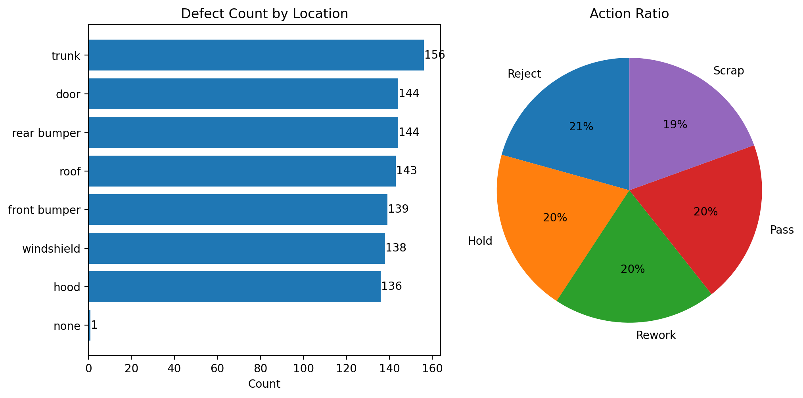
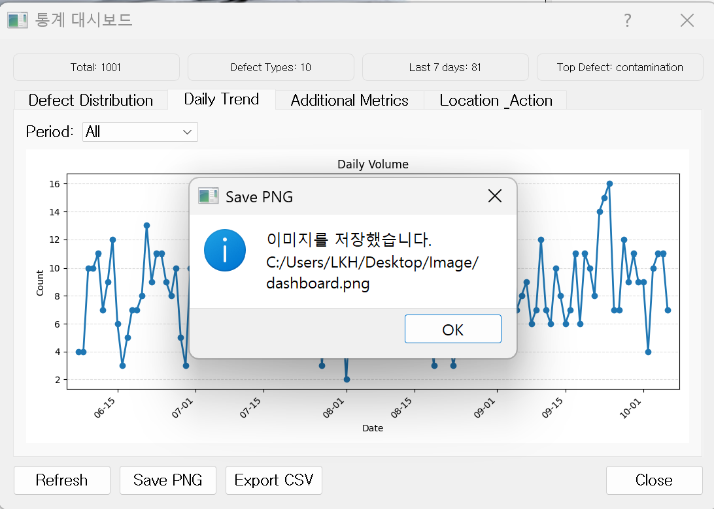
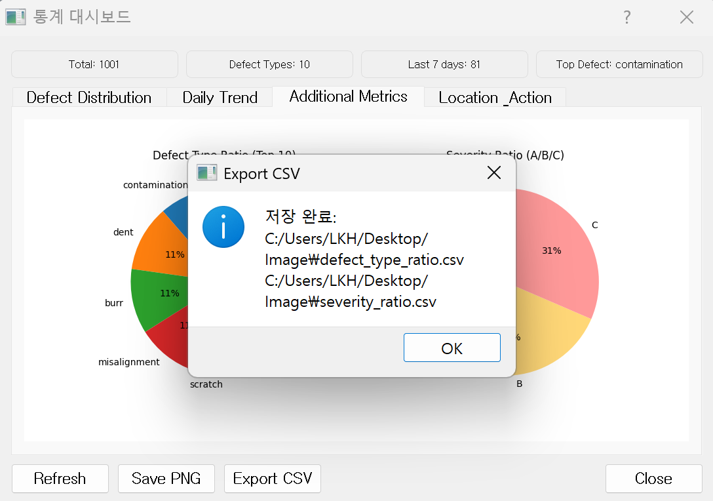

# 🚗 자동차 불량 분류 보조 시스템 (VisionQC)

자동차 외장 불량 이미지를 **PyQt5 GUI**로 업로드 → **GPT 기반 분류/설명** → **SQLite DB 저장·검색**까지 한 번에 처리하는 **품질 관리 보조 시스템**입니다.  
GPT 모델 기반의 비전 분석 보조 툴로, **불량 분류·설명 자동화 + 기록·검색 편의성 강화**에 초점을 맞춘 프로젝트입니다.

---

## 📌 주제 및 선정배경
자동차 산업에서는 품질 관리(QA/QC)를 위해 불량 부품 이미지를 빠르게 분류하고 기록하는 것이 중요합니다.  
기존 AOI 장비는 비용이 높고, 모든 불량을 완벽히 구분하지 못하는 한계가 있습니다.  

이에 불량 이미지를 자동으로 분류·설명하고, 결과를 DB에 저장·검색할 수 있는  
**자동차 품질 관리 보조 시스템(VisionQC)**을 구현하고자 합니다.

---

## 🎯 목표
- 카메라로 촬영한 자동차 부품 이미지를 GPT를 통해 자동 분석  
- **스크래치, 균열, 오염, 납땜 불량, 변형, 정렬불량, 부품 누락 등** 유형 분류 및 설명 제공  
- 결과를 SQLite DB에 저장하고 **PyQt5 GUI**를 통해 검색·조회  

---

## 🧩 주요 기능

| 구분 | 설명 |
|------|------|
| 🖼️ **이미지 업로드 및 분류(Classify)** | 단일/다중 이미지 업로드 후 GPT 기반 분류 수행 |
| 💾 **DB 저장 (SQLite3)** | 결과를 자동 저장 및 불러오기 |
| 🔍 **검색 및 삭제** | 툴바를 통한 DB 검색 / 선택 행 삭제 |
| 📊 **통계 대시보드** | 불량 데이터의 통계 분석 및 시각화 (4개 탭) |
| 💾 **Save PNG / Export CSV** | 그래프 또는 데이터 내보내기 기능 |
| 📂 **Export DB (CSV)** | 전체 DB를 CSV 파일로 저장 |

---

## 🛠 진행 상황 (2025-10-05 기준)
- [x] **단일/폴더 업로드** → GPT 분류 및 설명 출력 → DB 저장  
- [x] **DB 스키마 정리**: `results` 단일 테이블
- [x] **검색 기능 추가**: 라벨, 키워드, 날짜 범위 필터링
- [x] **삭제 기능 추가**: 선택된 행 삭제 후 테이블 갱신
- [x] **중복 저장 방지**: UNIQUE 인덱스 + `INSERT OR IGNORE` / UPSERT 적용
- [x] **CarDD 샘플링 스크립트 추가** (실행 시 대상 폴더 비우기 옵션 지원)
- [x] **통계 대시보드 4탭 구성** (`Defect Distribution`, `Daily Trend`, `Additional Metrics`, `Location & Action`)   
- [x] **통계 대시보드 Image/CSV Export 기능**
- [x] **툴바 Export DB (CSV)** — `app.db` 전체를 CSV 파일로 내보내기  

---

## 🧩 사용 기술
- **Python**
- **PyQt5** — GUI 구성  
- **OpenAI API (gpt-4o-mini)** — 불량 유형 및 설명 자동 생성  
- **SQLite3** — 경량 데이터베이스  
- **dotenv (.env)** — 환경 변수 관리  
- **Matplotlib** — 통계 대시보드 및 시각화
- **Pandas**
- **Numpy**

---

## ⚙️ .env 설정
루트 디렉토리에 `.env` 파일 생성:  

```env
OPENAI_API_KEY=sk-xxxxxxxxxxxxxxxx
DB_PATH=app.db
👉 DB_PATH는 생략 시 app.db 기본값을 사용합니다.
👉 API Key는 OpenAI 계정에서 발급받아야 합니다.
```

---

## 📂 데이터셋 출처

본 프로젝트에서는 **CarDD (Car Damage Dataset)** 를 활용하여 GPT-4o mini 기반 분류 실험을 진행합니다.

CarDD는 차량 외장 손상 이미지 약 4,000장을 포함하고 있으며, 스크래치, 찌그러짐, 균열, 변색, 오염 등 다양한 불량 유형을 포함합니다.

- [CarDD 공식 페이지](https://cardd-ustc.github.io/?utm_source=chatgpt.com)

---

## 🔁 전체 흐름

1. 이미지 업로드
2. 프롬프트(분류 요청) 전달
3. GPT-API를 통한 불량 유형 분류/설명
4. 결과 출력 및 SQLite DB 저장
5. 검색 기능으로 불량 유형/날짜별 탐색
6. 데이터 시각화

---

## 📷 예시 시나리오

- 공정 중 **자동차 부품 이미지를 촬영**
- **GPT가 자동으로 불량 유형을 태깅**
  - 예: `"scratch", confidence = 0.82`
- **DB(app.db)** 에 날짜, 불량 유형, 심각도(Severity) 저장
- **검색 기능**을 통해 “스크래치”, “9월 균열” 등의 키워드로 빠른 조회
- **대시보드에서 통계 시각화**
  - 불량 유형별 발생 빈도 / 일자별 추이 / 조치(Action) 비율 확인 가능

---

## 📸 실행 화면 (Execution Screenshots)

### 🖥️ 메인 화면
이미지 업로드 → GPT 분류 → DB 저장 → 결과 표시


### ✅ 분류 결과 예시
자동차 이미지에서 결함을 분석하고 결과를 DB에 저장합니다.


---

### 📊 통계 대시보드 (Stats Dashboard)

#### 1️⃣ Defect Distribution
심각도(Severity)별 결함 발생 빈도를 나타내는 스택형 바 차트  


#### 2️⃣ Daily Trend
일자별 불량 발생 추이를 보여주는 라인 차트  


#### 3️⃣ Additional Metrics
- Defect Type Ratio (Top10)  
- Severity Ratio (A/B/C)


#### 4️⃣ Location & Action
위치별 결함 분포 및 조치(Action) 비율 시각화  


#### 5️⃣ 전체 불량 분포 예시


---

### 💾 Export 기능
그래프 저장 및 CSV 내보내기 기능이 구현되어 있습니다.

| 기능 | 설명 | 예시 |
|------|------|------|
| **Save PNG** | 대시보드 이미지를 파일로 저장 |  |
| **Export CSV** | 그래프별 데이터를 CSV 파일로 내보내기 |  |

---

### 🗂️ Database 뷰 (결과 테이블)
불량 분류 결과가 SQLite DB(`app.db`)에 저장되며 테이블로 표시됩니다.  


---

## 🔧 시스템 구성도
```css
[ 사용자 ]
   ↓
[ PyQt5 GUI ]
   ↓                ↘
[ 이미지 업로드 + 프롬프트 ]   [ 검색 질의 ]
   ↓                          ↘
[ GPT-4o mini API 호출 ]      [ SQLite DB ]
   ↓                          ↗
[ 불량 유형 분류 + 설명 출력 ]
   ↓
[ 결과 DB 저장 및 화면 표시 ]
   ↓
[ 데이터 시각화 ]
```
---

## 📁 디렉토리 구조
```css
defect_inspector/
├── gui/
│   └── main_app.py
│   └── main_window.py
│   └── stats_view.py
├── api/
│   └── openai_api.py
├─ assets/
├── db/
│   └── db.py
├── scripts/
│   └── make_test_db.py
├── utils/
│   └── config.py
│   └── cardd_sampler.py 
│   └── file_handler.py
├── main.py
├── app.db
├── .env.example
└── requirements.txt
```

---

## 🚀 확장 아이디어

- 이미지 전처리(OpenCV) 기반 보조 특징 추출 (예: 에지 검출 후 GPT 보조 판정)

---

## 📦 requirements.txt
```txt
# GUI
PyQt5>=5.15.9

# Data / DB
pandas>=2.0.0
sqlite-utils>=3.36.0

# Visualization
matplotlib>=3.8.0

# API & Config
openai>=1.0.0
python-dotenv>=1.0.0

# Utilities
pathlib
```

---

## 👨‍💻 개발자
**이광호 (Kwangho Lee)**  
성균관대학교 기계공학부  

- GitHub: [@mavro7910](https://github.com/mavro7910)  
- Email: [kwangho97@g.skku.edu]

---

## 📜 License
이 프로젝트는 [MIT License](./LICENSE)를 따릅니다.

---
